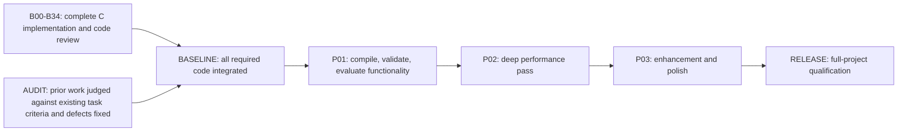

# Implementation dependency graph

This view records all 41 tasks in [dependencies.json](dependencies.json), published as vibecheck-jev plan revision 6. The ledger owns current work claims. Reports recorded before judgment recovery are unverified; see [the recovery audit](audit/README.md). Local task status fields retain the published snapshot and are not a live completion report.

No build, test, sanitizer, benchmark, or executable runs occur before the BASELINE source-completion gate.

The grouped diagram shows phase order. The table below records every direct prerequisite, including the full baseline gate. Code can be written concurrently against agreed interfaces. A task can be accepted only after its prerequisites are complete.

## Exact prerequisites

| Task | Work | Direct prerequisites |
|---|---|---|
| `AUDIT` | Audit all prior work against existing graph criteria and fix confirmed defects | None; review starts immediately |
| `B00` | Register the implementation graph | None |
| `B01` | C build and core foundation | None |
| `B02` | Archive readers | `B01` |
| `B03` | Mounts and shared resource ownership | `B02` |
| `B04` | Map formats | `B01` |
| `B05` | Models and images | `B01` |
| `B06` | World identity and collision | `B04` |
| `B07` | Session scheduling and lifetime | `B06` |
| `B08` | Movement and player commands | `B06`, `B07` |
| `B09` | Combat inventory and composition | `B07` |
| `B10` | Q1 built-in gameplay | `B08`, `B09` |
| `B11` | Q2 built-in gameplay | `B08`, `B09` |
| `B12` | Q3 built-in gameplay | `B08`, `B09` |
| `B13` | Campaigns and authored interactions | `B10`, `B11`, `B12` |
| `B14` | Modes objectives and equipment | `B10`, `B11`, `B12` |
| `B15` | Product catalog and configuration | `B03`, `B13`, `B14` |
| `B16` | Scene materials and resources | `B03`, `B04`, `B05` |
| `B17` | CPU renderer | `B16` |
| `B18` | GL renderer and display | `B16` |
| `B19` | Audio and media | `B03`, `B01` |
| `B20` | Input and local seats | `B01`, `B08` |
| `B21` | Console settings localization | `B01`, `B03` |
| `B22` | QC compatibility | `B03`, `B07`, `B09` |
| `B23` | QVM compatibility | `B03`, `B07`, `B09` |
| `B24` | Native module compatibility | `B03`, `B07`, `B09` |
| `B25` | Independent mod integration | `B14`, `B15`, `B22`, `B23`, `B24` |
| `B26` | Bots and navigation | `B06`, `B08`, `B09`, `B14` |
| `B27` | Network transport and codecs | `B01`, `B07` |
| `B28` | Network session and prediction | `B08`, `B09`, `B15`, `B27` |
| `B29` | Downloads browser and administration | `B03`, `B21`, `B27` |
| `B30` | Saves recovery and demos | `B07`, `B13`, `B25`, `B28` |
| `B31` | Progression and player services | `B13`, `B14`, `B27` |
| `B32` | Menus HUD and guest presentation | `B15`, `B16`, `B19`, `B20`, `B21`, `B25`, `B29`, `B30`, `B31` |
| `B33` | Tools cameras capture and LLM | `B16`, `B21`, `B27` |
| `B34` | Application integration and packaging | `B10`, `B11`, `B12`, `B13`, `B14`, `B15`, `B17`, `B18`, `B19`, `B20`, `B21`, `B25`, `B26`, `B28`, `B29`, `B30`, `B31`, `B32`, `B33` |
| `BASELINE` | Complete baseline release code | `B00`, `B01`, `B02`, `B03`, `B04`, `B05`, `B06`, `B07`, `B08`, `B09`, `B10`, `B11`, `B12`, `B13`, `B14`, `B15`, `B16`, `B17`, `B18`, `B19`, `B20`, `B21`, `B22`, `B23`, `B24`, `B25`, `B26`, `B27`, `B28`, `B29`, `B30`, `B31`, `B32`, `B33`, `B34`, `AUDIT` |
| `P01` | Build verification and full functionality evaluation | `BASELINE` |
| `P02` | Deep performance pass | `P01` |
| `P03` | Enhancement and polish | `P02` |
| `RELEASE` | Final full-project qualification | `P03` |

## Scope and completion

[source-map.json](source-map.json) assigns all 23 functional targets and the donor's 27 top-level source directories to the relevant C tasks. One donor directory can contribute to several C modules. Shared implementations retain intentional policies and private state. These assignments account for scope and do not establish implementation or runtime coverage.

B00 through B34 include writing build definitions and reviewing source for parser behavior, memory ownership and logic. Build configuration, compilation, parser or test execution, sanitizers and program runs begin at P01 after the entire baseline source is implemented and integrated. Deep performance work follows at P02.

At P01, run `python3 tools/check_plan.py` from the repository root to check the graph and target assignments. The checker verifies prerequisites, cycles, baseline ordering, and scope references. It does not approve code or replace vibecheck-jev's work reports.
